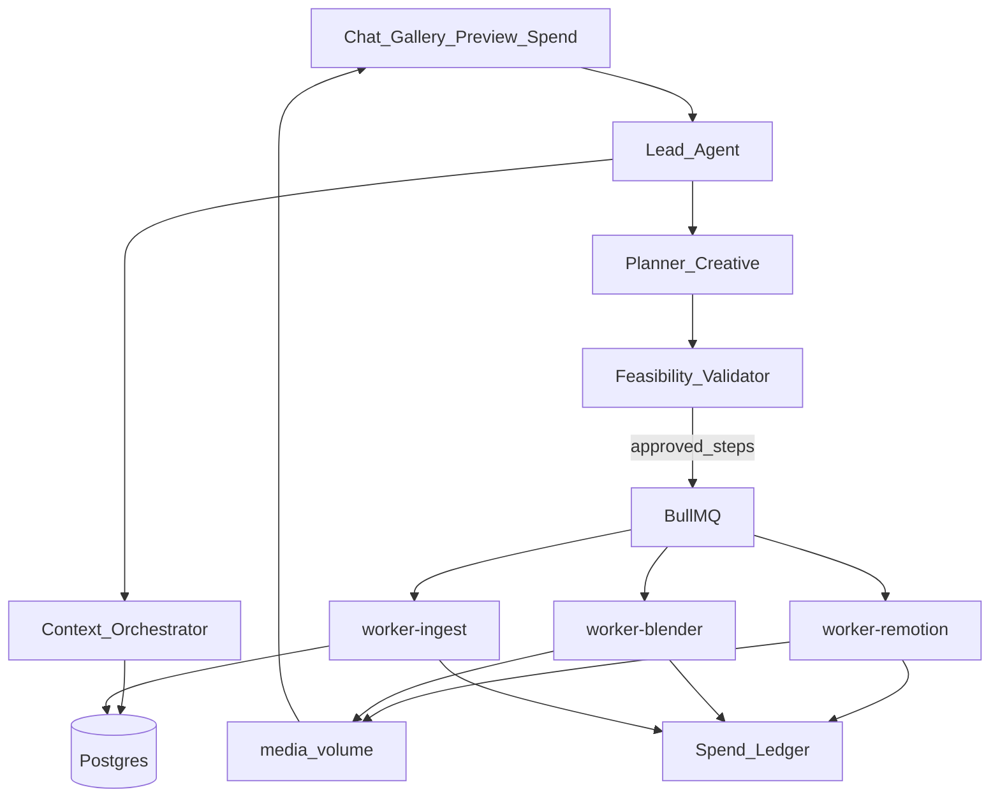

# Chatshoot — Personal Studio Plan

**Active track.** Single-operator, local Docker studio for by-order client videos. Not SaaS.

Source: original architecture plan (Chatshoot Studio Architecture), updated with ship status as of **2026-09-09**.

Deferred multi-tenant ideas live under [`saas-future/`](./saas-future/).

---

## Status at a glance

| Phase | Name | Status |
|-------|------|--------|
| Archive | `docs/saas-future/` | **Done** |
| **A** | Spine (compose, projects, gallery, spend, clean) | **Done** |
| **B** | Plan gate (planner, validator, cost OK, Remotion preview, revise) | **Done** |
| **C** | Ingest memory (Azure VI, pgvector, context slices) | **Done** |
| **D** | Blender worker → plates into Remotion | **Done** (CPU mock/fallback plates; GPU optional later) |
| **E** | GenFill + crawl (catalog-enforced) | **Done** (GenFill polish still light) |
| **F** | Audio + operator voice (TTS VO, STT mic) | **Done** |
| **Ship** | Regression + deploy-vm doc | **Done** (`scripts/regression.sh`, `docs/deploy-vm.md`) |

### Post-phase “order desk” slices (after A–F spine)

| Slice | Status |
|-------|--------|
| SaaS Remotion kit (logo + UI + b-roll + title/CTA) | **Done** |
| Preview player seek / pause / duration fixes | **Done** |
| Timeline beat strip (seek) | **Done** |
| ffmpeg export MP4 | **Done** |
| Stack L/R→T/B, crop, trim on b-roll | **Done** |
| VO + captions muxed into preview/export | **Done** |
| Music bed (generated + gallery preference) | **Done** |
| VO-only revise | **Done** |
| Selective deltas (copy-only / edit-only, keep VO) | **Done** |
| Gallery kit-slot pinning | **Done** |
| Plan progress UI + `completed` / `failed` rollup | **Done** |
| Blender showroom plate → kit fusion (`plateUrl`, no title wipe, remotion delay) | **Done** → sequencing now FlowProducer chain |
| Operator cheat-sheet (`docs/operator.md`) | **Done** |
| Blender→Remotion job chain (no fixed 7s delay) | **Done** |
| Real Cycles showroom/cafe plates (procedural scripts) | **Done** | Worker resolves scripts via `__dirname`; PNG plates (~2MB) |
| GenFill kit fusion (no title wipe) | **Done** | Writes `genfillMeta` / optional `brollUrl` only |
| Agent `revise_timeline` (beat timings, $0) | **Done** |
| Plate source in live preview (Cycles vs fallback) | **Done** |
| Timeline bake-on-approve (`reexport`) | **Done** |
| Regression: plate source + timeline + bake | **Done** | `scripts/regression.sh` + `POST /api/plans` `revise_timeline` |

### Still open / partial

| Item | Status | Notes |
|------|--------|-------|
| Agent-mutable beat-by-beat timeline | **Done** | `revise_timeline` → inline `timeline` step; VerticalShort + export honor beats |
| CapCut-scale multi-cut NLE | Not built | Out of v1; beat strip + kit only |
| GenFill kit fusion polish | **Done** | No longer overwrites titles; mock/API timeouts protected |
| Hand-authored `.blend` showroom assets | Partial | Procedural Cycles kits ship; craft `.blend` files still optional for Tier C polish |
| Optional spoken agent replies | Not built | Mic STT for operator is enough for now |

---

## Product frame

- **Not SaaS.** You produce client videos to order. Single-operator tool.
- **All local.** Postgres, Redis, media volumes, app, workers on your machine (or one VM). External APIs only for LLM / Replicate / TTS-STT / crawl / Azure VI.
- **Deliverable:** shorts/reels/shop ads by default; **9:16** primary, also 16:9.
- **Core loop:** ingest → understand → plan → estimate cost → OK → execute → preview → revise/reverse → settle spend → export.
- **Post-result edits:** chat/voice → delta plan → re-estimate → OK → run (same gate).

---

## Hard architectural bets (locked)

| Decision | Choice |
|---|---|
| Primary compositor / timeline / preview | **Remotion** |
| 3D environments / camera / video planes | **Blender** → plates into Remotion |
| Generative fill | **Replicate last resort**, shortest clip |
| Preview UX | Remotion Player prop updates (not Blender frame-stream) |
| Consent | Estimated API $ → OK → run |
| Creative loop | Planner ↔ validator, bounded retries, logs |
| Spend | Net API costs; estimate then settle; per-project |
| Memory | **Hybrid** — structured truth + embeddings for search |
| Hosting | Docker Compose |
| LLM | OpenAI via Vercel AI SDK |
| Video understand | Azure Video Indexer |

### Hybrid memory

- Structured metadata (projects, parts, plans, assets, notes) is source of truth; agents get **retrieved slices**.
- Embeddings for fuzzy search only.
- On ingest: structured fields + optional embedding of caption/transcript/notes.

---

## Honest capability ceiling

Templated production desk — not Hollywood.

| Tier | What it is | Sellable? |
|---|---|---|
| **A. Motion-graphics short** | Remotion kit + text/photos + TTS | **Yes — best ROI** |
| **B. Footage assembly** | Client clips, cuts, captions, VO | **Yes — main gap closed for stack/crop/trim** |
| **C. 3D env + plates** | Pre-built `.blend` → Remotion | **Path Done; needs real kits for quality** |
| **D. Gen-video patches** | 3–5s Replicate | **Partial; last resort only** |
| **E. Web series / movie** | Long-form narrative | **Do not sell as automated** |

**Money is in:** templates + taste + client relationships. Chatshoot is accelerator + cost logger, not creative director.

---

## System shape

---

## Domain model

- **Project** — client job; series of **Parts**
- **Part** — one output timeline (`preview_props`, `timeline_json`, export path)
- **Plan / Plan steps** — gated, reversible; statuses through `preview_ready` → plan `completed`/`failed`
- **Asset** — gallery item; optional `metadata.kitSlot` (logo / product / b-roll / music)
- **Persona / Environment / Concept** — reusable memory objects
- **Job** — remotion / blender / ingest / tts / …
- **SpendEvent** — estimate → settle / void; per-project totals

**Clean storage:** per-project purge; Settings master flush (keep spend history by default).

---

## Capability catalog

Versioned DB table shared by Planner + Validator:

- Remotion kits/comps and edit ops
- Blender templates (showroom/cafe)
- Replicate models + max duration (shortest-clip rules)
- TTS/STT / crawl tools

Update when providers change so the planner stops hallucinating impossible steps.

---

## Gated production + revise

Step flow: `draft → estimated → approved → running → preview_ready → accepted | rejected`  
Plan rollup: `completed` / `failed` when steps finish.

**Revise deltas (operator):**

| Intent | Steps | Preserves |
|--------|--------|-----------|
| VO-only (`VO:` / “longer VO”) | TTS (+ re-export) | Kit visuals |
| Copy-only (Title/Subtitle/CTA) | Remotion | `audioUrl`, captions, music |
| Edit-only (stack/crop/trim) | Remotion + ffmpeg | VO + music |
| Full brief | Remotion + TTS as needed | — |
| Showroom / blender | Blender then delayed Remotion | Titles; plate merges via `plateUrl` |

**Reverse:** restore previous timeline/asset pointers (artifacts until project clean).

---

## App skeleton

| Service | Role |
|---|---|
| `web` | Next.js — chat (+mic), gallery, Remotion Player, spend, export |
| `postgres` | Postgres + pgvector |
| `redis` | BullMQ |
| `worker-remotion` | Compose, edits, VO mux, music, export |
| `worker-blender` | Headless plates (CPU; GPU optional) |
| `worker-ingest` | Embeddings, Azure VI, crawl |

App: **http://localhost:2980** (compose may map web differently; local dogfood often uses 2980).

---

## Original build phases (detail)

### Phase A — Spine — Done

Compose + Postgres + media volume; projects/parts; gallery upload/notes; chat shell; rate table; spend estimate/settle; per-project + master clean.

### Phase B — Plan gate — Done

Planner + Validator + step machine + logs; Remotion Player; cost OK; revise-after-result.

### Phase C — Ingest memory — Done

Captions/transcripts; Azure Video Indexer (mockable without keys); pgvector; context orchestrator slices.

### Phase D — Blender — Done

Showroom/cafe **procedural Cycles** scripts → PNG under `media/plates/`; worker resolves scripts next to `index.js` (not `cwd`). SVG fallback only if Blender missing/fails. Callback sets **only** `plateUrl`. Remotion waits via FlowProducer chain.

### Phase E — GenFill + crawl — Done

Replicate minimal segment + catalog clamp + timeouts; crawl enqueue + spend. GenFill callback preserves kit titles (`genfillMeta` / optional b-roll fuse).

### Phase F — Audio + operator voice — Done

ElevenLabs/Sarvam (or stub) VO; chat mic STT; music bed.

### Phase Ship — Regression — Done

`scripts/regression.sh` + `docs/deploy-vm.md`.

---

## Dogfood project

- **HumanTest1** — primary proving ground for each slice  
  - project `a349b316-c7c6-47ad-8f54-4c98722232f7`  
  - part `ff5126a4-8a39-4846-80f8-7fee876e082e`

---

## Suggested next work (priority)

1. **Hand-authored `.blend` kits** (optional) — drop real showroom/cafe `.blend` files for higher Tier C quality.
2. **Shop/reel second kit** if client work needs non-SaaS layouts.
3. **Operator UX** — show bake vs preview-only on timeline cost dialog.

---

## Explicit non-goals (still)

- Multi-user auth, wallets, credits marketplace (see `saas-future/`)
- Managed cloud DB requirement
- Real-time Blender frame streaming
- Perfect face-consistent multi-episode identity
- Requiring a GPU to use the studio

---

## Related docs

- [README](../README.md) — quick start
- [Operator cheat-sheet](./operator.md)
- [Deploy to another VM](./deploy-vm.md)
- [SaaS future (deferred)](./saas-future/README.md)
